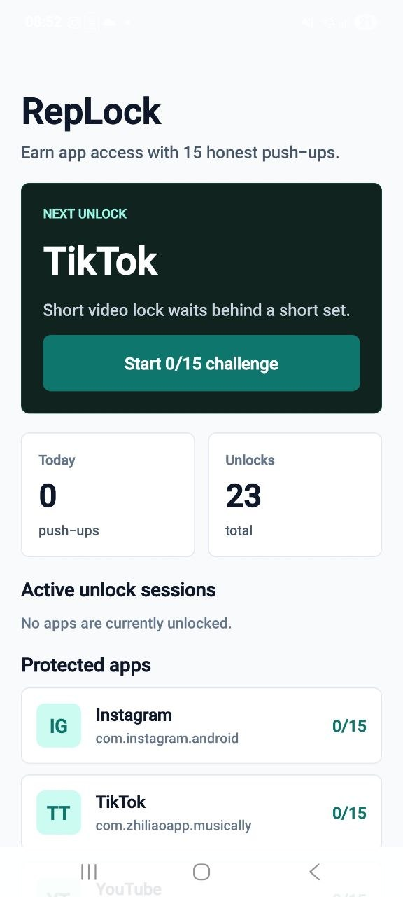
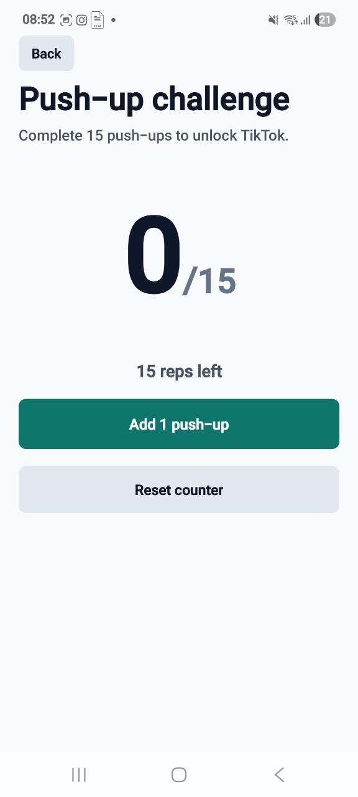
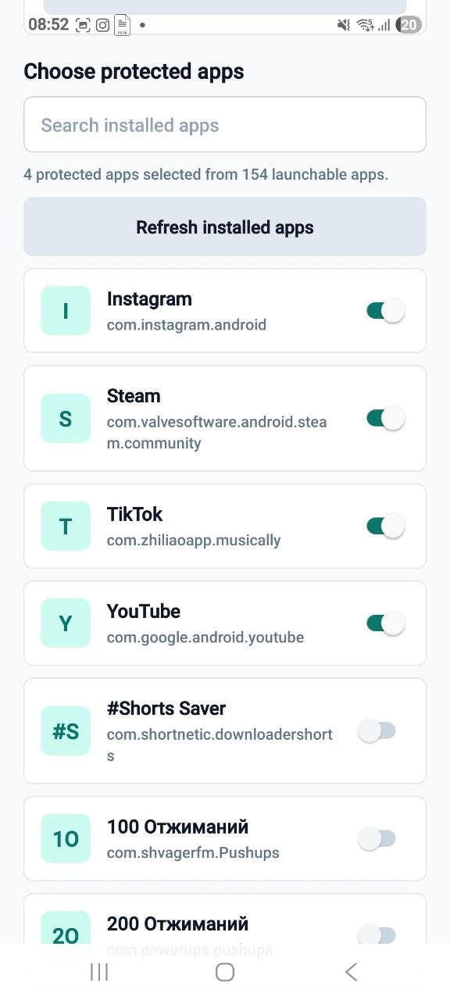

# RepLock / PushToUnlock54

RepLock is an Android discipline app that blocks distracting apps and makes the user complete push-up challenges before accessing them.

Built with **Expo SDK 54**, **React Native**, and **native Android Kotlin**, RepLock is a working blocker MVP focused on one behavior: turn impulse app opens into intentional physical effort.

## Screenshots / Preview



**Home screen**



**Push-up challenge**



**Protected apps settings**

## How It Works

```text
Open TikTok
→ RepLock challenge opens
→ Complete push-ups
→ App unlocks temporarily
→ After unlock expires, challenge returns
```

Users can protect TikTok, Instagram, YouTube, games, or any installed Android app. When a protected app is opened, RepLock redirects into a challenge screen. Completing the required reps grants a temporary unlock session, then the selected app opens automatically.

## Current Features

- Android app blocking
- `AccessibilityService` detection
- Automatic challenge redirect
- Push-up challenge
- Configurable required push-ups per unlock
- Configurable unlock durations
- Protected app picker
- Installed app discovery through Android `PackageManager`
- Native Kotlin integration
- Temporary unlock sessions
- Local progress/statistics
- Detection Debug screen
- Expo Dev Build support

## Tech Stack

- React Native
- Expo SDK 54
- Expo Dev Client
- JavaScript
- Native Android Kotlin modules
- Android `AccessibilityService`
- Android `PackageManager`
- Android `SharedPreferences`
- AsyncStorage / local storage
- EAS Build

## Architecture

### React Native

React Native owns the product experience:

- Home, Settings, Locked Apps, Challenge, Success, Progress, and Detection Debug screens
- Manual push-up counter
- Required push-up setting
- Unlock duration setting
- Protected app selection UI
- Local statistics and progress
- AsyncStorage persistence
- Calls into native Kotlin for blocker actions

### Native Android Kotlin

Kotlin owns the Android enforcement layer:

- Detects foreground app changes with `AccessibilityService`
- Stores protected package names in native storage
- Redirects locked app opens into RepLock
- Stores per-package temporary unlock sessions
- Launches target apps after successful unlock
- Lists installed launchable apps through `PackageManager`
- Exposes native debug state to React Native

## Blocker Flow

1. User selects protected apps in Settings.
2. React Native saves the selection locally.
3. React Native syncs selected package names to native Kotlin.
4. `RepLockAccessibilityService` detects foreground app changes.
5. If the opened package is protected and locked, RepLock opens the challenge deep link.
6. User completes the push-up challenge.
7. React Native calls native `unlockApp(packageName, durationMs)`.
8. Kotlin saves `unlockedUntil` for that package.
9. Kotlin launches the target app.
10. During the unlock window, the app opens freely.
11. After expiration, the challenge returns.

## Required Permissions

### Accessibility

Required for detecting when selected apps become foreground. Users must enable RepLock manually in Android Accessibility Settings.

### Display Over Other Apps

Overlay permission is supported from earlier blocker prototypes. The current preferred MVP flow redirects quickly into RepLock instead of relying on a long-lived overlay, but overlay support may still be useful for future transition screens.

### Camera

Camera permission is only needed for the experimental camera challenge prototype. Manual push-up counting remains the stable unlock path.

## Installation And Development

Install dependencies:

```bash
npm install
```

Start the Expo Dev Client server:

```bash
npx expo start --dev-client -c
```

Create an Android development build:

```bash
eas build -p android --profile development
```

RepLock uses native Android code, so Expo Go is not enough for the blocker flow. Use an Expo Dev Build installed on a real Android device.

## Testing Checklist

### Setup

- Install the Android development build.
- Open RepLock.
- Enable RepLock in Android Accessibility Settings.
- Enable overlay permission if testing overlay behavior.
- Select protected apps in Settings.
- Choose required push-ups per unlock.
- Choose unlock duration.

### Core Blocker Test

- Open a protected app, such as TikTok, Instagram, YouTube, or another selected app.
- Confirm RepLock opens the challenge automatically.
- Press Back before completing the challenge.
- Confirm the protected app remains locked.
- Open the protected app again.
- Confirm RepLock challenges again.
- Complete the manual push-up counter.
- Confirm the target app opens automatically.
- Reopen the same app during the unlock window.
- Confirm no challenge appears.
- Wait for the unlock duration to expire.
- Open the app again.
- Confirm RepLock challenges again.

### Debug Test

- Open Detection Debug.
- Confirm selected protected package names appear.
- Confirm last detected package updates.
- Confirm last blocked package and launch result are visible.
- Confirm remaining unlock time updates after a successful challenge.

## Current Limitations

- Android only.
- Requires Expo Dev Build because native Kotlin code is required.
- Accessibility permission must be enabled manually.
- Android does not allow RepLock to directly pause or mute another app.
- Manual push-up counting is currently the stable unlock mechanism.
- Camera-based pose tracking is experimental and not yet the production counter.
- No backend or account sync.
- No production anti-cheat system yet.
- Accessibility behavior may vary across Android OEMs.

## Future Roadmap

- AI camera push-up detection
- Pose skeleton tracking
- Automatic rep counting
- Anti-cheat system
- Better onboarding
- Permission status improvements
- Calibration and confidence scoring
- Production release

## EAS Free Build Notes

EAS Build free tier usage is limited. Native changes require a new development build, so avoid unnecessary rebuilds when only JavaScript UI changes are being tested.

Use `npx expo start --dev-client -c` for JavaScript iteration after the dev build is installed. Rebuild with EAS when native Kotlin, Android manifest, Gradle dependencies, config plugins, or native permissions change.

## Status

RepLock currently has a working Android blocker MVP: protected app detection, automatic challenge redirects, manual push-up unlocks, temporary unlock sessions, installed-app selection, configurable unlock durations, and native debug visibility.

